# CivicTwin
## Municipal Urban Operational Layer & Spatial Digital Twin

See the city. Predict the risk. Act before it escalates.

<p align="center"> <a href="https://civictwin-web-silk.vercel.app/"><strong>Live Demo</strong></a> · <a href="https://github.com/SIDDHARTHXMEUR/CIVICTWIN"><strong>GitHub Repository</strong></a> </p>

### Overview
CivicTwin is a real-time municipal operations and spatial intelligence platform that turns fragmented urban signals into a single operational picture.
It brings together citizen reports, geographic context, infrastructure status, sensor telemetry, anomaly intelligence, severity prioritization, and municipal response workflows.

CivicTwin is the operational layer between what a city observes and what a city does.

> *Urban data is only valuable when it helps someone make a faster, better decision.*

---

### The Problem
A city can have the right data and still respond slowly.
A water leak may begin as a citizen complaint. A pressure sensor may detect an abnormal reading. A traffic signal may behave unexpectedly. An environmental sensor may report an AQI spike.

When these signals live in separate systems, the operator has to connect the dots manually.

The operational chain becomes:
```
Report → Verify → Locate → Prioritize → Dispatch → Resolve
```
CivicTwin brings that process into one spatial workspace.

**From fragmented signals to one operational picture**
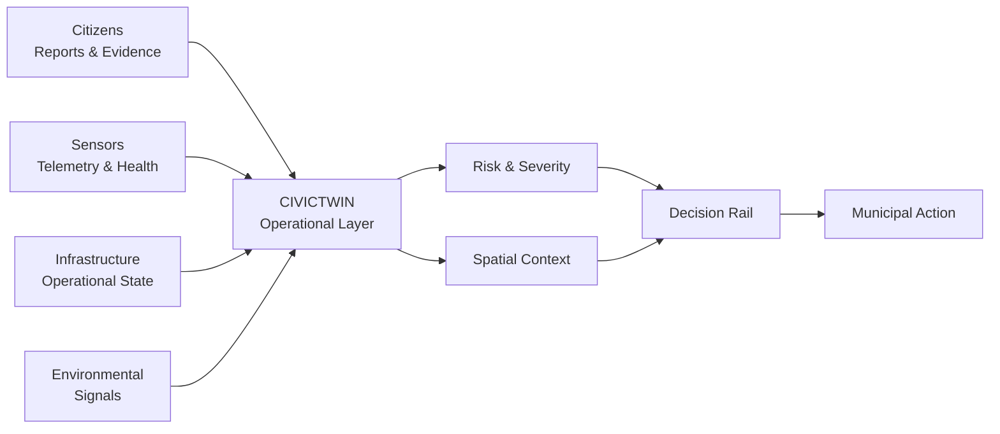
*What is happening? Where is it happening? How serious is it? What should happen next?*

---

## 01 — Product Model
CivicTwin is organized around one operational loop:
`Observe → Predict → Act`

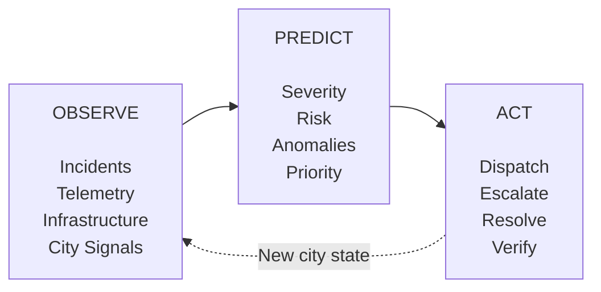

**Observe**: Build a live picture of what is happening across the city.  
**Predict**: Turn incoming signals into severity, risk, corroboration, and operational priority.  
**Act**: Put the next useful action directly in front of the operator.

The interface is therefore centered on decisions, not data for its own sake.

---

## 02 — Core Capabilities

### Spatial Digital Twin
The Spatial Digital Twin is the geographic operating surface of CivicTwin.
It provides spatial and operational context for:
- incidents
- infrastructure conditions
- risk signals
- sensor assets
- operational status

| Dimension | Operator context |
| :--- | :--- |
| **Location** | Where the event is happening |
| **Severity** | How serious it is |
| **Category** | What kind of event it is |
| **Risk state** | Normal, emerging, or critical |
| **Operational status** | Active, responding, or resolved |
| **Telemetry** | What connected assets are reporting |

The prototype supports **Satellite**, **Vector**, and **Topographic** map representations.

### Citizen Incident Gateway
Citizens can submit infrastructure issues directly into the municipal workflow.
Supported categories include:
- Water leakage and pipe fractures
- Road hazards and drainage overflow
- Traffic bottlenecks and signal desynchronization
- Environmental anomalies such as AQI surges
- Infrastructure failures

**Reporting flow**
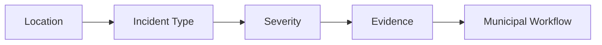
GPS-based location tagging reduces the gap between discovering a problem and creating a usable incident.

**Intelligent Report Merging**
Repeated reports can represent the same underlying event.
CivicTwin can cluster identical reports within a 500 m radius, allowing the system to:
- consolidate duplicate reports
- increase corroboration count
- preserve the underlying location
- strengthen prioritization
- reduce map clutter

### AI Severity & Risk Intelligence
Every incoming incident is evaluated by the intelligence layer.
The product model considers:
- Severity level
- Impact estimate
- Spatial relevance
- Escalation priority
- Recommended response strategy

The intelligence layer is designed as decision support: it helps operators focus attention without removing the human from the response loop.

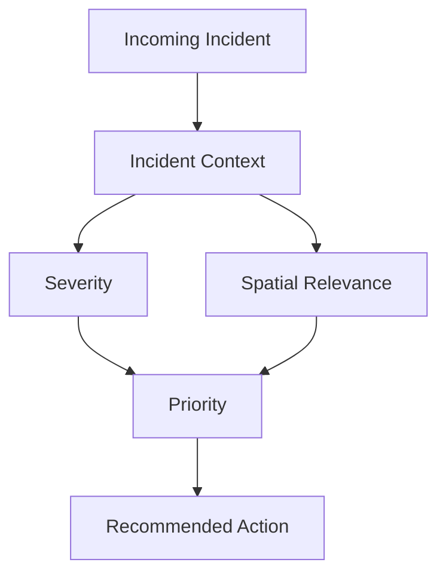

### Municipal Command Center
The Command Center is the main operational environment.
Operators can monitor:
- city-wide incident distribution
- high-priority anomalies
- spatial risk
- sensor telemetry
- emergency alerts
- response actions
- active incident counts

The navigation layer also exposes live domain activity through dynamic incident-count badges.

### Decision Rail
The Decision Rail is where intelligence becomes action.
Instead of forcing an operator through several screens to understand an alert and find the relevant control, CivicTwin surfaces contextual response actions beside the operational information.

Alerts can expose:
- corroboration metrics such as `REPORTED BY: 3`
- relative timestamps
- incident context
- severity
- response actions
- resolution state

Example actions:
`DISPATCH CREW` · `NOTIFY TRANSIT` · `VERIFY TELEMETRY` · `ISOLATE GRID`

**Decision path**
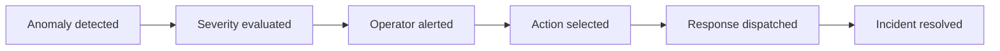
A **Resolved Today** log keeps recently cleared incidents visible without losing operational history.

### Telemetry Asset Registry
Municipal sensor assets can be inspected individually.

| Metric | Purpose |
| :--- | :--- |
| **Frequency (Hz)** | Sensor reporting rate |
| **Packet Loss (%)** | Communication reliability |
| **Diagnostic Ping** | Device health and latency |
| **Location** | Spatial context and substation node |
| **Status** | Normal, Warning, or Anomaly |

This connects the event on the map with the asset producing the signal.

---

## 03 — System Architecture
CivicTwin separates collection, intelligence, and operations while keeping them connected through common spatial context.

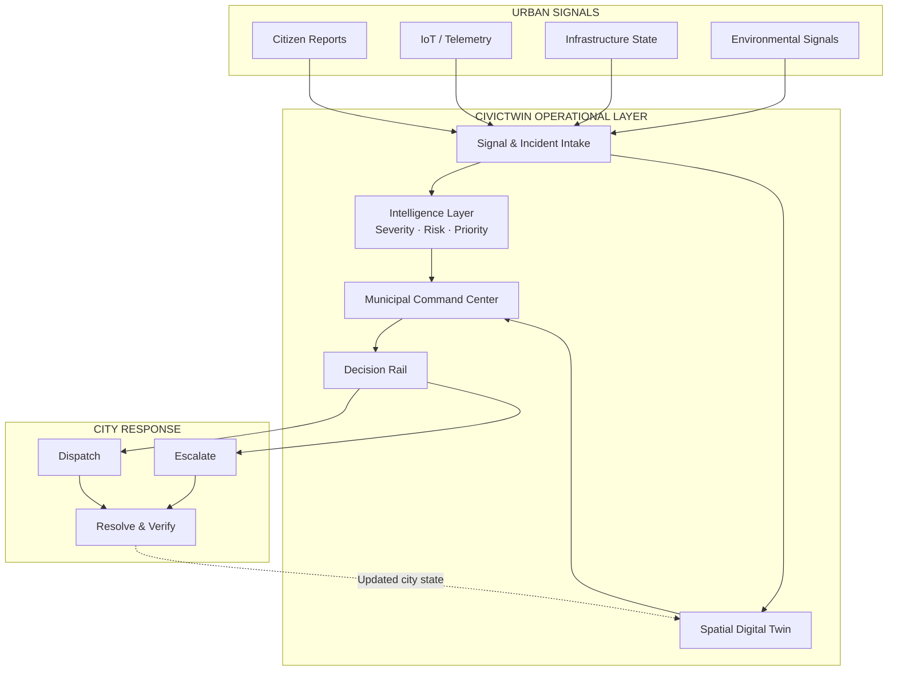

**Product layers**
| Layer | Responsibility |
| :--- | :--- |
| **Citizen Layer** | Capture observations, location, incident type, and evidence |
| **Intelligence Layer** | Evaluate severity, spatial relevance, risk, and priority |
| **Municipal Layer** | Visualize, investigate, decide, dispatch, and resolve |

---

## 04 — End-to-End Operational Workflow

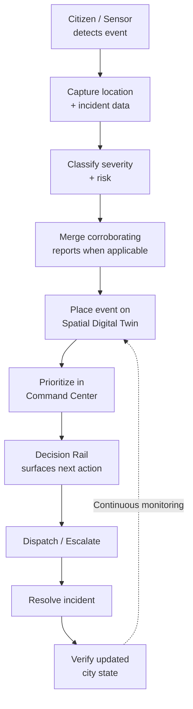
`Detect → Understand → Locate → Prioritize → Act → Verify`

---

## 05 — Example Scenario: Water Infrastructure Failure
Imagine a major water-main leak.

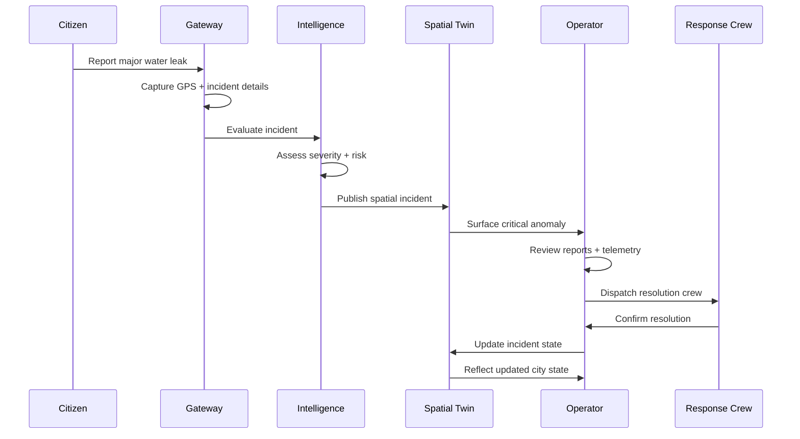

**Incident path**
- **Report** — A citizen discovers a major water-main leak.
- **Locate** — GPS attaches the incident location.
- **Classify** — The report is categorized as a physical infrastructure issue.
- **Assess** — The intelligence layer evaluates severity and risk.
- **Visualize** — The event appears on the Spatial Digital Twin.
- **Prioritize** — Corroboration and available telemetry strengthen the context.
- **Act** — The Decision Rail presents an appropriate response.
- **Resolve** — A response crew addresses the incident.
- **Verify** — The incident and city state are updated.

Prototype example coordinates:
`26.9124, 75.7873`

---

## 06 — Application Modules

| Module | Responsibility |
| :--- | :--- |
| `Gateway.tsx` | Municipal access and incident gateway; role-based entry, public reporting, officer login, spatial preview, alerts, and global search |
| `CitizenApp.tsx` | Citizen incident submission, classification, GPS tagging, severity triage, and Command Center handoff |
| `App.tsx` | Main municipal operations environment |
| `GridTopologyPanel.tsx` | Leaflet Spatial Digital Twin, basemap switching, incident markers, clustering, and telemetry assets |
| `IntelligencePanel.tsx` | Observe → Predict → Act intelligence workflow and anomaly resolution |
| `DecisionRail.tsx` | Contextual incident alerts and response controls |
| `KpiStrip.tsx` | Operational KPI presentation |
| `Sidebar.tsx` | Primary navigation and live domain indicators |
| `TopBar.tsx` | Global operational controls and context |

---

## 07 — Design System
CivicTwin deliberately moves away from the familiar dark dashboard + neon gradient + glass card aesthetic.
The interface follows a Swiss Functionalist / International Typographic direction built around hierarchy, grid discipline, restrained color, and operational clarity.

**Visual language**
- **Grid**: The city is treated as a structured information system.
- **Typography**: Large editorial typography establishes hierarchy, while monospace typography handles operational labels, telemetry, and system data.
- **Geometry**: Sharp edges and precise alignment make the interface feel closer to an instrument panel than a marketing dashboard.

**Color as information**
| Token | Value | Meaning |
| :--- | :--- | :--- |
| **Civic Cyan** | `#4FC9DC` | Active / operational |
| **Critical Red** | `#EA3B1B` | Critical / anomaly |
| **Ink** | `#0A0A0A` | Structure / typography |
| **Warm Sand** | `#F0EDE4` | Canvas |
| **Card Surface** | `#F5F2E8` | Components |
| **Inset Surface** | `#E8E4D8` | Nested content |

**Design rules**
- No unnecessary gradients.
- No decorative glassmorphism.
- Sharp 0px corners.
- Strict grid discipline.
- Minimal visual noise.
- Color is semantic, not decorative.
- Every component must communicate information or enable an action.

---

## 08 — Technology Stack

| Area | Technology |
| :--- | :--- |
| **Frontend** | React 19 |
| **Language** | TypeScript |
| **Build** | Vite |
| **Styling** | Tailwind CSS / Vanilla CSS |
| **Icons** | Lucide React |
| **Spatial Mapping** | Leaflet + React-Leaflet |
| **Map Tiles** | CartoDB Satellite / Vector |
| **State** | Zustand |
| **Typography** | Hanken Grotesk + JetBrains Mono |

---

## 09 — Getting Started

**Prerequisites**
- Node.js v18.0.0+
- npm v9.0.0+
- Modern web browser

**Run locally**
1. **Clone**
   ```bash
   git clone https://github.com/SIDDHARTHXMEUR/CIVICTWIN.git
   cd CIVICTWIN
   ```

2. **Install dependencies**
   ```bash
   npm install
   ```

3. **Configure environment**
   The current prototype is designed to run without external API keys.
   If `.env.example` is present:
   ```bash
   cp .env.example .env
   ```

4. **Start**
   ```bash
   npm run dev
   ```

5. **Open**
   `http://localhost:5173`

   **Live Demo**: [https://civictwin-web-silk.vercel.app/](https://civictwin-web-silk.vercel.app/)

---

## 10 — Access Model
CivicTwin separates public reporting from municipal operations.

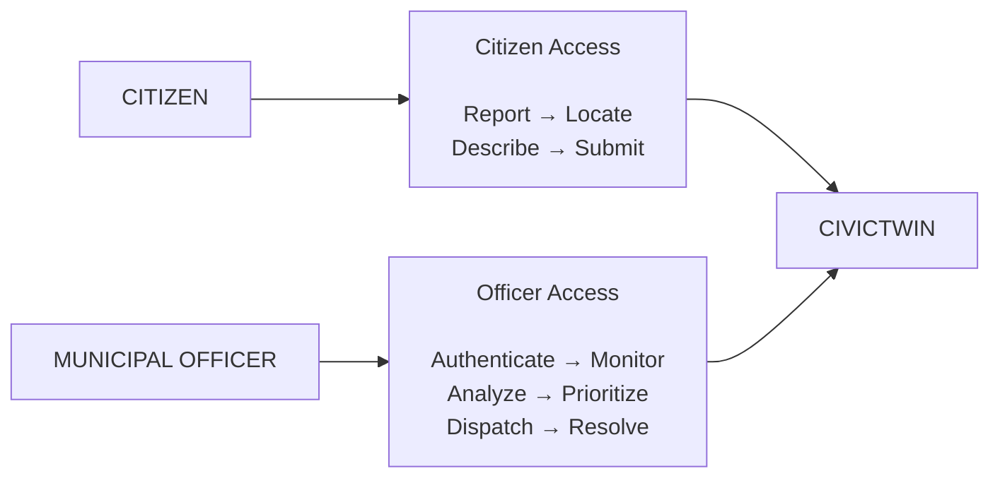

**Citizen**
`REPORT → LOCATION → INCIDENT DETAILS → SUBMIT`

**Municipal officer**
`AUTHENTICATE → MONITOR → ANALYZE → PRIORITIZE → DISPATCH → RESOLVE`

---

## 11 — Performance Principles
The prototype prioritizes responsiveness because an operational interface should not slow down the person using it.
- Lightweight Leaflet spatial rendering
- Selective Zustand subscriptions
- Avoidance of unnecessary re-renders
- Minimal visual overhead
- Fast tab switching
- Reduced navigation between information and action

The operator should spend time making decisions, not finding the screen that contains the decision.

---

## 12 — Project Structure
```text
CIVICTWIN/ 
├── apps/ 
│   └── web/ 
│       ├── src/ 
│       │   ├── components/ 
│       │   │   ├── Gateway.tsx 
│       │   │   ├── CitizenApp.tsx 
│       │   │   ├── GridTopologyPanel.tsx 
│       │   │   ├── IntelligencePanel.tsx 
│       │   │   ├── DecisionRail.tsx 
│       │   │   ├── KpiStrip.tsx 
│       │   │   ├── Sidebar.tsx 
│       │   │   └── TopBar.tsx 
│       │   ├── store/ 
│       │   │   └── index.ts 
│       │   ├── App.tsx 
│       │   └── index.css 
│       ├── package.json 
│       └── vite.config.ts 
├── .env.example 
├── .gitignore 
├── README.md 
└── package.json
```

---

## 13 — Roadmap
The current prototype establishes the operational foundation. The longer-term direction is to evolve CivicTwin from incident response toward predictive urban operations.

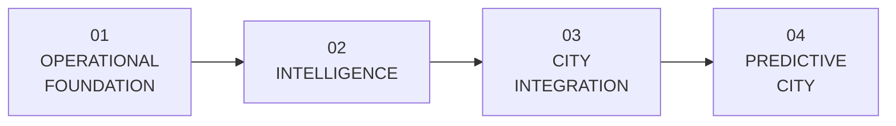

**Phase 01 — Operational Foundation**
Current
- Incident management
- Spatial Digital Twin
- Citizen reporting
- Municipal Command Center
- Telemetry asset directory

**Phase 02 — Intelligence**
- Predictive infrastructure-failure scoring
- Automated incident clustering
- Dynamic risk forecasting

**Phase 03 — City Integration**
Potential integrations:
- Municipal IoT streams
- Traffic-camera computer vision
- Water-grid telemetry
- Public grievance systems

**Phase 04 — Predictive City**
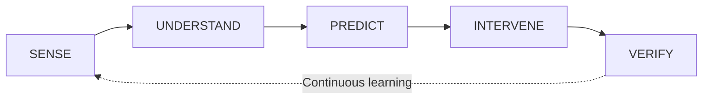
The goal is to move from reactive incident handling toward proactive infrastructure intervention.

---

## 14 — Impact
CivicTwin is designed around four practical outcomes:

| Goal | Operational effect |
| :--- | :--- |
| **Faster** | Reduce the path from incident discovery to dispatch |
| **Smarter** | Use severity and risk to focus attention where it matters |
| **More transparent** | Maintain a visible incident lifecycle from report to resolution |
| **More predictive** | Surface emerging conditions before they become larger failures |

One city. One operational picture. One path from signal to action.

---

## 15 — Current Status
**Status:** Active Development · Hackathon Prototype

The current prototype demonstrates the complete operational loop:

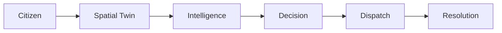

The prototype is focused on demonstrating the product workflow and operational experience. A production deployment would require additional infrastructure, integrations, security controls, data governance, and validation.

---

## 16 — Why CivicTwin
Most civic technology starts with a portal.
Most dashboards start with data.
CivicTwin starts with the decision.

The product connects:
`people → places → signals → intelligence → action`

A city does not need another screen showing that something is wrong.
It needs a system that helps the right person understand what is wrong, where it is, how urgent it is, and what should happen next.
That is the role CivicTwin is designed to fill.

---

## 17 — Vision
Cities already generate enormous amounts of data. The missing layer is often not another data source — it is the operational interface that connects those signals to decisions.

CivicTwin is being built to become that layer.

See the city. Predict the risk. Act before it escalates.

**CivicTwin**  
**Municipal Urban Operational Layer & Spatial Digital Twin**  
*Observe → Predict → Act*

<p align="center"> <a href="https://civictwin-web-silk.vercel.app/"><strong>Live Demo</strong></a> · <a href="https://github.com/SIDDHARTHXMEUR/CIVICTWIN"><strong>Repository</strong></a> </p>

**Built for Urban Intelligence**
