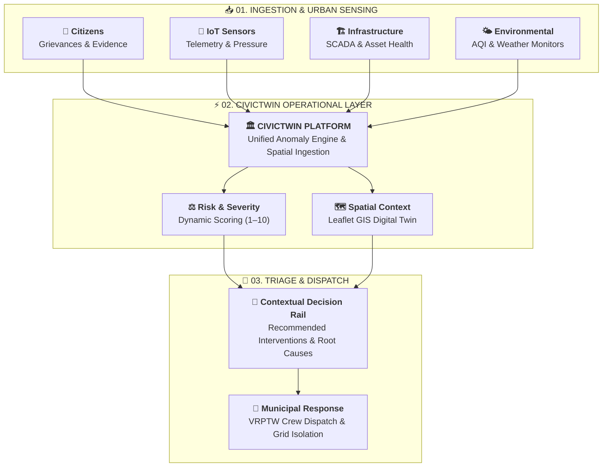
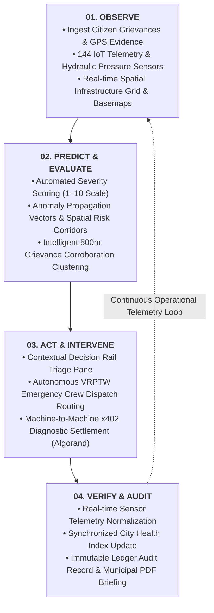
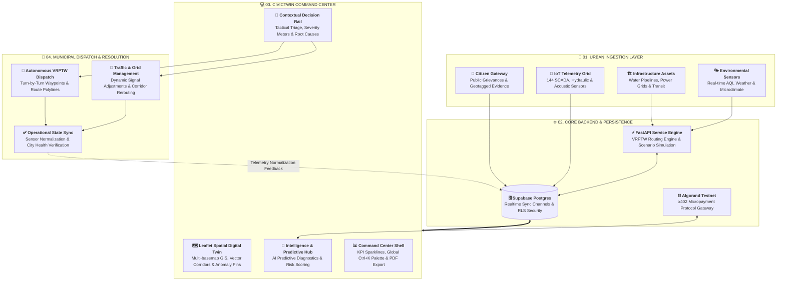
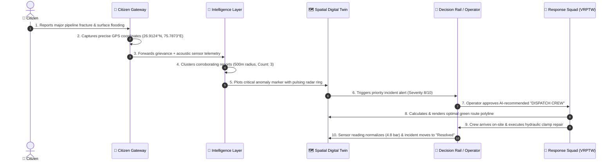
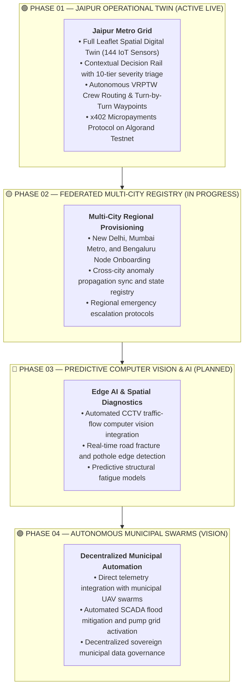

# CivicTwin
### Municipal Urban Operational Layer, Spatial Digital Twin & Algorand x402 Micropayments

<p align="center">
  <em>See the city. Predict the risk. Act before it escalates.</em>
</p>

<p align="center">
  <a href="https://civictwin-web-silk.vercel.app/"><strong>🌐 Live Deployment</strong></a> &nbsp;&nbsp;|&nbsp;&nbsp; 
  <a href="https://github.com/SIDDHARTHXMEUR/CIVICTWIN"><strong>📂 GitHub Repository</strong></a>
</p>

---

> [!IMPORTANT]
> **CivicTwin** is an open-source municipal operations and spatial intelligence platform that unifies fragmented urban telemetry, public grievances, and GIS spatial layers into a single real-time operational layer — built with **Algorand Testnet x402 micropayments** for decentralized machine-to-machine AI failure diagnostics and immutable audit trails.

---

## 📑 Table of Contents
- [Executive Overview](#-executive-overview)
- [Algorand Blockchain Integration](#-algorand-blockchain--x402-protocol)
- [The Problem: Fragmented City Signals](#-the-problem-fragmented-city-signals)
- [Repository Architecture](#-repository-architecture)
- [Quick Start Guide](#-quick-start-guide)
- [01 — Product Model: The Operational Loop](#01--product-model-the-operational-loop)
- [02 — Core Capabilities & System Features](#02--core-capabilities--system-features)
- [03 — Technical Architecture & Data Flow](#03--technical-architecture--data-flow)
- [04 — Flagship Scenario: Water Infrastructure Failure](#04--flagship-scenario-water-infrastructure-failure)
- [05 — Application Modules Reference](#05--application-modules-reference)
- [06 — Design System & Mission Control Typography](#06--design-system--mission-control-typography)
- [07 — Full Technology Stack](#07--full-technology-stack)
- [08 — Backend API Specification](#08--backend-api-specification)
- [09 — System Maturity & Verification Status](#09--system-maturity--verification-status)
- [10 — Roadmap & Future City Federation](#10--roadmap--future-city-federation)
- [11 — Platform Vision](#11--platform-vision)

---

## 🏛️ Executive Overview

Municipal systems historically operate in disconnected silos:
- **Citizen grievances** arrive through disparate portals and social queues.
- **SCADA pressure sensors** broadcast telemetry to isolated engineering boards.
- **Transit and traffic signals** feed independent control dashboards.
- **Field response squads** coordinate via ad-hoc radio and phone calls.

When critical urban infrastructure breaks, municipal operators lose critical minutes manually correlating signals across disjointed screens.

**CivicTwin serves as the missing operational layer between what a city observes and what a city does:**
1. **Unifies Urban Signals**: Combines citizen geotagged grievances, 144 IoT telemetry sensors, and multi-layer GIS into one synchronized cockpit.
2. **Predicts Failure Cascades**: Evaluates spatial anomaly propagation and severity with transparent, rule-based scoring (1–10 scale).
3. **Surfaces Contextual Decisions**: Recommends immediate tactical interventions through an actionable **Decision Rail**.
4. **Dispatches Autonomous Crews**: Computes shortest-path emergency routes using simulated **Vehicle Routing with Time Windows (VRPTW)**.
5. **Algorand Decentralized Settlement**: Implements **x402 machine-to-machine micropayments** directly on **Algorand Testnet** for trustless, cryptographic diagnostic data monetization and audit logging.

> *"Urban data is only valuable when it directly empowers an operator to make a faster, higher-confidence decision."*

---

## ⛓️ Algorand Blockchain & x402 Protocol

CivicTwin leverages **Algorand** as its decentralized settlement layer for sovereign urban intelligence:

- **Algorand Testnet Settlement**: High-throughput, low-latency transaction finality (~3.3 seconds) perfectly matched for municipal machine-to-machine (M2M) telemetry verification.
- **x402 HTTP Paywall Standard**: Enables automated API consumers, autonomous vehicles, and private utilities to purchase high-value predictive failure reports with sub-cent `0.05 ALGO` micropayments.
- **Cryptographic Auditability**: Every unlocked failure diagnostic generates an immutable on-chain transaction hash (`TxID`), providing tamper-proof municipal accountability without intermediary fees.
- **Non-Custodial Wallet Integration**: Seamless support for Pera Wallet and direct Algorand node / indexer signing via `@x402-avm/core`.

---

## ⚡ The Problem: Fragmented City Signals

A major water-main rupture may begin as an underground pressure drop, trigger a citizen grievance, flood an arterial thoroughfare, and cause cascading traffic gridlock miles away. When telemetry lives in separate databases, operators must connect the dots manually.

```
Citizen Grievance ──┐
IoT Telemetry     ──┼──▶ [ Siloed Databases ] ──▶ Manual Operator Correlation ──▶ Delayed Dispatch
Infrastructure    ──┘
```

CivicTwin closes this gap by orchestrating ingestion, spatial correlation, predictive triage, and field response into a single closed loop:



---

## 📂 Repository Architecture

CivicTwin is structured as a clean, production-grade monorepo:

```
CIVICTWIN/
├── apps/
│   └── web/                 # Frontend: React 19, TypeScript, Vite, Zustand, Leaflet GIS
│       ├── src/
│       │   ├── components/  # Command Center, Decision Rail, GIS Map, Payments, Citizen App
│       │   ├── store/       # Zustand persistent store & live telemetry simulation loop
│       │   ├── config/      # Map coordinate configs (Jaipur Metro Grid center & zoom)
│       │   └── lib/         # Web3 Algorand Testnet, Supabase client, and audio utilities
├── services/
│   └── api/                 # Backend: FastAPI (Python 3.12, Uvicorn, Pydantic)
│       ├── routers/         # Incidents, Reports, VRPTW Routing, Scenario Simulation, Auth
│       ├── database.py      # SQLAlchemy SQLite/Postgres connection & schema compatibility
│       └── main.py          # FastAPI application server entrypoint & WebSocket handlers
├── supabase/
│   └── migrations/          # Declarative Postgres schemas, RLS policies & Realtime channels
├── infra/                   # Deployment configurations and seed data
├── DESIGN_SYSTEM.md         # UI/UX guidelines, color tokens & typography standards
├── README.md                # Technical project documentation
└── docker-compose.yml       # Containerized local orchestration
```

---

## 🚀 Quick Start Guide

### Prerequisites
- **Node.js**: `v18.0.0+` with `npm v9.0.0+`
- **Python**: `v3.10+` (with `pip` or `uv`)
- **Web Browser**: Any modern evergreen browser (Chrome, Firefox, Edge, Safari)

### 1. Clone the Repository
```bash
git clone https://github.com/SIDDHARTHXMEUR/CIVICTWIN.git
cd CIVICTWIN
```

### 2. Frontend Setup (Web App)
```bash
cd apps/web
npm install
npm run dev
```
> The web interface will be available at **`http://localhost:5173`**.

### 3. Backend Setup (FastAPI Engine)
```bash
cd services/api
pip install -r requirements.txt
uvicorn main:app --reload --port 8000
```
> The API server will be available at **`http://localhost:8000`**.

---

## 01 — Product Model: The Operational Loop

CivicTwin operates on a continuous, four-stage feedback cycle:

$$\text{Observe} \longrightarrow \text{Predict} \longrightarrow \text{Act} \longrightarrow \text{Verify}$$



1. **Observe**: Ingest real-time citizen reports and sensor telemetry onto an interactive spatial map.
2. **Predict**: Evaluate severity scores, failure cascade likelihood, and spatial propagation corridors.
3. **Act**: Present direct, human-authorized tactical resolution actions alongside raw telemetry.
4. **Verify**: Confirm resolution via sensor normalization and update city health indicators.

---

## 02 — Core Capabilities & System Features

### 🗺️ 1. Leaflet Spatial Digital Twin (GIS Centerpiece)
The primary spatial operating surface for city-wide infrastructure monitoring:
- **Jaipur Metro Grid Topology**: Centered at `26.9124° N, 75.7873° E` with 144 connected IoT sensor nodes.
- **Dynamic 3-Tier Severity Encoding**:
  - *Normal* (`#64748b` / `#10b981`): 8px calm baseline marker.
  - *Warning* (`#f59e0b`): 12px amber marker for elevated risk.
  - *Critical Anomaly* (`#ea3b1b`): 18px red-orange marker with animated radar pulsing ring.
- **Multi-Basemap Switching**: Seamlessly toggle between **Vector GIS** (OpenStreetMap), **World Imagery Satellite** (ArcGIS), and **Topographic** terrain layers.
- **Edge-to-Edge Fullscreen Mode**: Custom resize engine invoking `map.invalidateSize()` across animation intervals to guarantee 100% viewport coverage.
- **Spatial Anomaly Propagation Vectors**: Visual dashed polylines indicating potential cascading impact corridors (e.g., MI Road pressure drop $\rightarrow$ Ajmeri Gate traffic gridlock).

---

### 🚨 2. Decision Rail & Contextual Triage
The operational nexus where spatial intelligence transforms into direct municipal action:
- **10-Segment Severity Meter**: Color-coded visual severity indicator (1–10 scale) on every incident card.
- **Root-Cause Diagnostic Drawer**: Expandable diagnostic pane detailing hydraulic pressure differentials, sensor spikes, and GPS coordinates.
- **Tactical Action Triggers**: Pre-configured operational commands (`DISPATCH CREW`, `REROUTE TRAFFIC`, `ISOLATE GRID`, `NOTIFY TRANSIT`).
- **Primary vs. Secondary Action Hierarchy**: High-contrast filled primary buttons paired with subtle ghost secondary actions.
- **"Resolved Today" Audit Log**: Chronological record of cleared incidents with relative timestamps (`Just now`, `5 min ago`).

---

### 🚚 3. Autonomous VRPTW AI Crew Dispatch Routing
Simulates a Vehicle Routing Problem with Time Windows (VRPTW) model for municipal logistics:
- **Routing Engine Endpoint**: Computes optimized emergency response paths based on incident category, urgency, and logistics depots.
- **Live Polyline Navigation**: Renders multi-stop dispatch paths on the Leaflet GIS digital twin with glowing drop shadows (`#10b981`).
- **Turn-by-Turn Waypoints**: Generates step-by-step route instructions from municipal logistics depots to incident coordinates.

---

### 💳 4. x402 Micropayment Protocol on Algorand Testnet
Demonstrates machine-to-machine micropayments for decentralized urban data access:
- **Payment-Gated AI Diagnostics**: 0.05 ALGO micropayments unlock predictive infrastructure failure analysis reports.
- **Algorand Testnet Transaction Signing**: Integration with Algorand indexers and testnet node gateways.
- **Cryptographic Audit Ledger**: Transaction ledger tracking Tx Hashes, amounts, resource paths, and settled timestamps.
- **Operational Resolution Action Card**: Tactical report generated post-settlement detailing crew assignments and estimated resolution timeframes.

---

### 📱 5. Citizen Incident Gateway (`CitizenApp.tsx`)
A public-facing portal empowering citizens to submit infrastructure issues seamlessly:
- **4-Step Submission Flow**:
  1. *Location*: Automatic GPS device geolocation tagging.
  2. *Category*: Selection across Water, Mobility, Environment, Electrical, and Structural.
  3. *Severity & Details*: User-reported severity slider and descriptive grievance input.
  4. *Evidence*: Image upload and immediate municipal command handoff.
- **Intelligent 500m Spatial Clustering**: Duplicate citizen reports within a 500-meter radius are automatically merged into parent incidents, incrementing `REPORTED BY: X` counters without cluttering the map.
- **Public Status Tracker**: Citizens receive unique tracking IDs (`JP-W01-XXXX`) to monitor real-time municipal resolution progress.

---

### 📊 6. Live KPI Strip & Telemetry Sparklines
Real-time urban health monitoring across key municipal indicators:
- **Core City Metrics**:
  - *City Health Score* (0–100 scale) with alert thresholds.
  - *Mobility Flow* (%) tracking corridor transit efficiency.
  - *Air Quality Index* (AQI) monitoring particulate pollution.
- **SVG Area Gradient Sparklines**: Gradient fill under trend lines with pulsing live endpoint indicators.
- **Tabular Numerals (`font-variant-numeric: tabular-nums`)**: Eliminates horizontal jitter during live telemetry updates.
- **Continuous 3-Second Simulation Loop**: Simulates sensor jitter, packet loss fluctuations, and diagnostic pings.

---

### 🌐 7. Federated Multi-City Twin Registry
A scalable architecture designed for state-wide and national municipal cohorts:
- **Active Jaipur Metro Node**: Full operational telemetry (`26.9124° N, 75.7873° E`).
- **Upcoming City Provisioning Queue**: Interactive selector supporting **New Delhi** (28.84°N), **Mumbai Metro** (19.07°N), and **Bengaluru Tech** (12.97°N).

---

### ⌨️ 8. Global Tactical Command Palette (`Ctrl+K`)
Keyboard-driven mission control navigation:
- **Fuzzy Search**: Search across all 144 sensor assets, active critical incidents, and domain views.
- **Emergency Shortcut Commands**: Trigger simulated grid anomalies, clear filters, and navigate to public or officer portals instantly.
- **Top Bar Integration**: Quick `[COMMANDS Ctrl K]` button in the top bar for easy discoverability.

---

### 📄 9. Municipal Operational Briefing PDF Export
Generate formal municipal executive reports with one click:
- **Executive Summary**: City health score, unresolved incident count, and settled micropayments.
- **Incident Matrix**: Tabular breakdown of incident IDs, severity scores, descriptions, and current lifecycle states.
- **x402 Audit Log**: Full cryptographic transaction hash ledger for administrative accountability.

---

## 03 — Technical Architecture & Data Flow



---

## 04 — Flagship Scenario: Water Infrastructure Failure

The following sequence illustrates CivicTwin's end-to-end operational chain during an underground water-main rupture:



1. **Signal Intake**: Acoustic pressure sensor `JP-W01` detects a pressure drop to 2.4 bar; a citizen concurrently submits a report with photo evidence via the Citizen Gateway.
2. **Corroboration**: The intelligence layer clusters duplicate reports within 500m and increments corroboration count to 3.
3. **Spatial Awareness**: The incident appears on the Leaflet GIS digital twin as a high-severity red anomaly pin (`#ea3b1b`) with a propagation vector toward Ajmeri Gate.
4. **Triage & Decision**: The Decision Rail surfaces the incident with recommended action `DISPATCH CREW` (Assigned: *Rapid Hydro Repair Squad #4*, ETA: 8 min).
5. **Dispatch & Routing**: The operator approves dispatch; the VRPTW routing engine calculates turn-by-turn waypoints and draws a green route polyline on the map.
6. **Resolution & Audit**: Following field repair, the sensor reading normalizes, the incident is marked resolved, and the event is appended to the audit ledger.

---

## 05 — Application Modules Reference

| Module | File Path | Core Responsibilities |
| :--- | :--- | :--- |
| `Gateway.tsx` | `apps/web/src/components/` | Municipal entrance, citizen vs. officer authentication, GIS map preview, system search |
| `CitizenApp.tsx` | `apps/web/src/components/` | Citizen reporting stepper, automatic GPS tagging, severity selection, photo upload |
| `App.tsx` | `apps/web/src/` | Main application shell, route views, realtime toast alerts, scrolling operational ticker |
| `GridTopologyPanel.tsx` | `apps/web/src/components/` | Leaflet GIS digital twin, vector/satellite/topo layers, fullscreen mode, crew polylines |
| `IntelligencePanel.tsx` | `apps/web/src/components/` | AI predictive failure reports, x402 payment gate, post-payment resolution action card |
| `DecisionRail.tsx` | `apps/web/src/components/` | Critical & warning alerts, severity meter bars, root-cause drawer, rapid action buttons |
| `KpiStrip.tsx` | `apps/web/src/components/` | High-impact telemetry metrics with SVG area gradient sparklines and delta percentages |
| `PaymentsPanel.tsx` | `apps/web/src/components/` | Algorand transaction ledger, x402 status verification, explorer tx hash links |
| `CommandPalette.tsx` | `apps/web/src/components/` | `Ctrl+K` modal for fuzzy searching nodes, incidents, and triggering municipal actions |
| `Sidebar.tsx` | `apps/web/src/components/` | Domain navigation (Infrastructure, Mobility, Environment, Payments) with active count badges |
| `TopBar.tsx` | `apps/web/src/components/` | Federated city switcher, briefing PDF export, dark/light theme toggle, user profile |

---

## 06 — Design System & Mission Control Typography

CivicTwin follows a **Tactical Mission Control / Functionalist** design system built for high-stress municipal operations.

### Typography Triad
- **Display & Headers**: **`Space Grotesk`** (Weights: 600, 700, 800 | Tracking: `-0.02em`) — Geometric, authoritative architectural character for panel titles and brand identity.
- **Body & Cards**: **`Plus Jakarta Sans`** (Weights: 400, 500, 600) — Humanist, ultra-crisp legibility across high-density incident cards.
- **Telemetry & Numbers**: **`JetBrains Mono`** (Weights: 500, 700, 800 | Tabular Figures: `tnum 1`) — Monospace alignment for GPS coordinates, sparkline values, and Algorand transaction hashes.

### Color Tokens
| Token | Hex Value | Operational Meaning |
| :--- | :--- | :--- |
| **Civic Cyan** | `#4FC9DC` | Active selection, route polylines, and primary operational accents |
| **Critical Red** | `#EA3B1B` | Anomaly nodes, critical severity (7–10), and emergency dispatch |
| **Warning Amber** | `#F59E0B` | Elevated risk, warning telemetry (4–6), and cascade notices |
| **Resolved Emerald** | `#10B981` | Settled micropayments, normal status (1–3), and verified nodes |
| **Obsidian Slate** | `#0B0C0E` / `#161922` | Dark mode tactical background and card frames |
| **Warm Sand** | `#F0EDE4` / `#F5F2E8` | Light mode canvas and component surfaces |

---

## 07 — Full Technology Stack

| Layer | Technologies | Role in CivicTwin |
| :--- | :--- | :--- |
| **Frontend Framework** | React 19, TypeScript, Vite v8 | High-density operational single-page application |
| **Styling & Theme** | Tailwind CSS v4, PostCSS, Vanilla CSS | Custom 3D beveled frames, tactical themes, micro-animations |
| **State Management** | Zustand v5 | Persistent store, reactive filters, and 3-second simulation loops |
| **GIS & Spatial Mapping** | Leaflet v1.9, React-Leaflet | Hardware-accelerated map rendering, custom DivIcons, polylines |
| **Map Basemaps** | OpenStreetMap, ArcGIS World Imagery, OpenTopoMap | Vector, satellite, and topographic basemap tiles |
| **Backend Framework** | FastAPI, Python 3.12, Uvicorn, Pydantic | RESTful endpoints, VRPTW crew routing, scenario simulations |
| **Database & Realtime** | Supabase Postgres / SQLite | Relational incident storage, spatial coordinates, Realtime channels |
| **Blockchain / Web3** | Algorand Testnet, `@x402-avm/core`, `@perawallet/connect` | Machine-to-machine x402 micropayments for diagnostic reports |
| **Icons & Fonts** | Lucide React, Google Fonts | Interface iconography, Space Grotesk, Plus Jakarta Sans, JetBrains Mono |

---

## 08 — Backend API Specification

| Method | Endpoint | Description |
| :--- | :--- | :--- |
| `GET` | `/` | Root service health check and Jaipur node metadata |
| `POST` | `/api/v1/routing/optimal-crew-dispatch` | Calculates VRPTW shortest crew route & waypoints |
| `POST` | `/api/v1/simulation/scenario` | Runs scenario simulations (`monsoon_flood`, `power_cascade`) |
| `GET` | `/api/incidents/` | Retrieves all active and resolved municipal incidents |
| `POST` | `/api/reports/` | Ingests new citizen grievances with coordinates & category |
| `GET` | `/api/infrastructure/` | Fetches connected infrastructure asset and sensor points |
| `WS` | `/ws/incidents` | WebSocket channel for real-time incident broadcast |

---

## 09 — System Maturity & Verification Status

| Capability | Current Status | Notes |
| :--- | :--- | :--- |
| **Spatial Digital Twin (GIS)** | **Implemented** | Leaflet multi-layer map with custom anomaly markers & fullscreen mode |
| **Decision Rail Triage** | **Implemented** | Severity meters, root-cause drawer, and action dispatch |
| **Citizen Gateway** | **Implemented** | 4-step reporting workflow with GPS tagging & clustering |
| **VRPTW Crew Routing** | **Implemented (Simulated)** | Algorithmic shortest-path route computation & polyline rendering |
| **x402 Micropayments** | **Implemented (Testnet)** | Algorand Testnet integration for payment-gated diagnostics |
| **Telemetry Sensor Feeds** | **Simulated** | 144 nodes with continuous 3-second simulation loop |
| **Multi-City Federation** | **Planned (Roadmap)** | Jaipur active; New Delhi, Mumbai, Bengaluru in provisioning queue |
| **Computer Vision Detection** | **Planned (Roadmap)** | Architecture defined for future CCTV edge inference models |

---

## 10 — Roadmap & Future City Federation



- **Phase 01 — Jaipur Operational Twin (Active)**: Full GIS digital twin, decision rail, autonomous VRPTW dispatch, and x402 payment gate.
- **Phase 02 — Multi-City Federated Registry**: Cross-city node telemetry sync and automated regional emergency escalation.
- **Phase 03 — Predictive Computer Vision**: Live CCTV traffic-flow computer vision integration and automated road fracture detection.
- **Phase 04 — Autonomous Municipal Swarms**: Direct integration with municipal UAVs, smart water pumps, and SCADA traffic light grids.

---

## 11 — Platform Vision

Cities already generate enormous volumes of data. The missing layer is not another dashboard — it is the **operational workspace** connecting those signals directly to decisions and immediate actions.

<p align="center">
  <strong>CivicTwin — Municipal Urban Operational Layer & Spatial Digital Twin</strong><br/>
  <em>Observe → Predict → Act</em>
</p>

<p align="center">
  <a href="https://civictwin-web-silk.vercel.app/"><strong>🌐 Live Demo</strong></a> &nbsp;&nbsp;|&nbsp;&nbsp; 
  <a href="https://github.com/SIDDHARTHXMEUR/CIVICTWIN"><strong>📂 GitHub Repository</strong></a>
</p>

<p align="center">
  <strong>Built for Resilient Cities & Urban Intelligence</strong>
</p>
