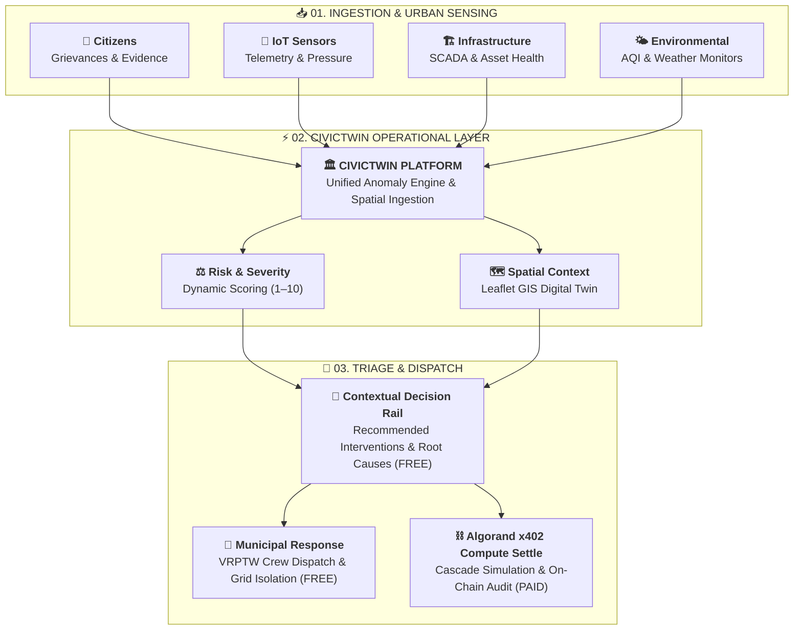
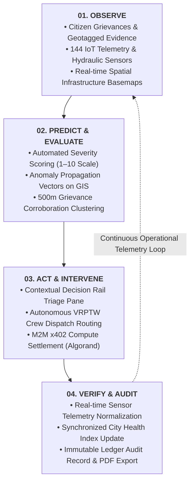
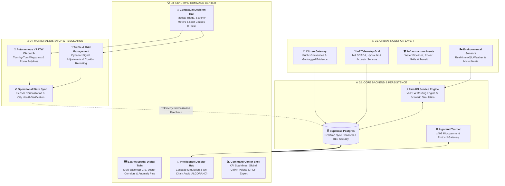
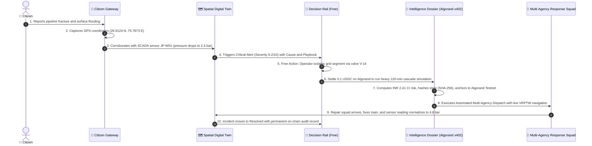
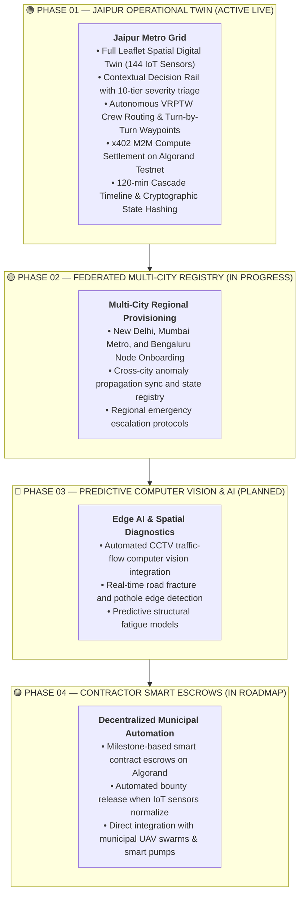

# CivicTwin
### Municipal Urban Operational Layer, Spatial Digital Twin & Algorand x402 Micropayments

<p align="center">
  <em>See the city. Predict the risk. Act before it escalates.</em>
</p>

<p align="center">
  <a href="https://civictwin-web-silk.vercel.app/"><strong>🌐 CivicTwin Web</strong></a> &nbsp;&nbsp;|&nbsp;&nbsp; 
  <a href="https://github.com/SIDDHARTHXMEUR/CIVICTWIN"><strong>📂 GitHub Repository</strong></a>
</p>

---

> [!IMPORTANT]
> **CivicTwin** is an open-source municipal operations and spatial intelligence platform that unifies fragmented urban telemetry, public grievances, and GIS spatial layers into a single real-time operational layer. Built with **Algorand Testnet x402 machine-to-machine (M2M) compute micropayments**, it anchors heavy predictive cascade simulations, automated multi-agency dispatch, and cryptographic tamper-evident diligence audits directly to the blockchain.

---

## 📑 Table of Contents
- [Executive Overview](#-executive-overview)
- [Algorand Blockchain & x402 M2M Compute Settlement](#-algorand-blockchain--x402-m2m-compute-settlement)
- [Free vs. Paid Features (Zero Barrier to Safety)](#-free-vs-paid-features-zero-barrier-to-safety)
- [Deep Dive: Intelligence & Unlocked Post-Payment Features](#-deep-dive-intelligence--unlocked-post-payment-features)
- [Recent Updates & Version 2.4 Highlights](#-recent-updates--version-24-highlights)
- [The Problem: Fragmented City Signals](#-the-problem-fragmented-city-signals)
- [Product Model: The Operational Loop](#-product-model-the-operational-loop)
- [Core Capabilities & System Features](#-core-capabilities--system-features)
- [Technical Architecture & Data Flow](#-technical-architecture--data-flow)
- [Flagship Scenario: Water Infrastructure Failure](#-flagship-scenario-water-infrastructure-failure)
- [Application Modules Reference](#-application-modules-reference)
- [Design System & Mission Control Typography](#-design-system--mission-control-typography)
- [Full Technology Stack](#-full-technology-stack)
- [Backend API Specification](#-backend-api-specification)
- [Quick Start Guide](#-quick-start-guide)
- [Roadmap & Future City Federation](#-roadmap--future-city-federation)
- [Platform Vision](#-platform-vision)

---

## 🏛️ Executive Overview

Municipal control centers historically operate in isolated, disconnected silos:
- **Citizen grievances** trickle in through disjointed portals, helplines, and social queues.
- **SCADA pressure & hydraulic sensors** broadcast raw telemetry to isolated engineering stations.
- **Transit and traffic signals** feed separate regional monitoring consoles.
- **Field response crews** coordinate via ad-hoc radio chatter and cell phone calls.

When critical urban infrastructure breaks, municipal operators waste precious minutes manually connecting the dots across disparate dashboards.

**CivicTwin provides the missing operational layer between what a city observes and what a city does:**
1. **Synchronizes Urban Signals**: Consolidates citizen geotagged grievances, 144 IoT telemetry sensors, and multi-layer GIS into one unified tactical cockpit.
2. **Predicts Failure Cascades**: Evaluates spatial anomaly propagation vectors and severity with transparent, rule-based scoring (1–10 scale).
3. **Surfaces Contextual Decisions**: Recommends immediate tactical interventions through an actionable, high-contrast **Decision Rail**.
4. **Dispatches Autonomous Crews**: Computes shortest-path emergency routes using simulated **Vehicle Routing with Time Windows (VRPTW)**.
5. **Algorand Decentralized Settlement**: Implements **x402 machine-to-machine micropayments** directly on **Algorand Testnet** to settle heavy predictive compute and anchor immutable audit trails.

> *"Urban data is only valuable when it directly empowers an operator to make a faster, higher-confidence decision."*

---

## ⛓️ Algorand Blockchain & x402 M2M Compute Settlement

### The Rationale: Why Algorand? Why Pay?
CivicTwin reframes payment around **Machine-to-Machine (M2M) Compute Settlement**:
- A free dashboard view cannot justify running heavy, resource-intensive mathematical hydraulic simulations, multi-vector graph traversals, and cryptographic state hashing across every minor sensor fluctuation.
- Rather than charging citizens or putting life-safety features behind a corporate credit card paywall, **Algorand micro-billing settles compute costs trustlessly in sub-seconds (~3.3s finality)** for high-grade computational workloads.
- Every payment settles `0.1 USDC` (or `0.05 ALGO`) on Algorand Testnet using the **x402 standard** (`HTTP 402 Payment Required`), generating an on-chain transaction hash (`TxID`) that cryptographically binds the compute request to its resulting state.

### Key Blockchain Mechanics
- **Algorand Testnet Speed & Finality**: Instant block confirmation (~3.3s) without re-org risk, perfectly suited for live municipal emergency dispatch.
- **Micro-Billing Efficiency**: Sub-cent transaction fees prevent municipal budget bloat while monetizing heavy compute resources.
- **Cryptographic State Anchoring**: Telemetry snapshots are SHA-256 hashed into an immutable digital digest and anchored to the ledger, creating a legally defensible audit record for municipal insurance, government oversight, and inter-agency accountability.
- **Non-Custodial Web3 Integration**: Compatible with Algorand indexers, Pera Wallet, and direct programmatic API clients via `@x402-avm/core`.

---

## ⚖️ Free vs. Paid Features: Zero Barrier to Safety

> [!NOTE]
> **Safety First Commitment**: Dispatching emergency crews, reviewing citizen grievances, isolating compromised grids, and viewing root-cause diagnostics are **always 100% free and immediate**. Payment never blocks an operator's ability to protect the public.

| Feature Category | Capability / Tool | Free Tier | Algorand Unlocked (M2M Settle) | Purpose & Operational Impact |
| :--- | :--- | :---: | :---: | :--- |
| **Public Grievances** | Citizen Incident Gateway & Geotagging | ✅ Free | — | Citizens report issues with GPS & photos; auto-clusters duplicate reports within 500m. |
| **Spatial Digital Twin** | Leaflet Multi-Basemap GIS & 144 Sensors | ✅ Free | — | View live sensor health, anomaly radar rings, and city infrastructure layers. |
| **Live Urban KPIs** | City Health, AQI, Mobility Sparklines | ✅ Free | — | Real-time trend sparklines with tabular numbers and 3-second live jitter. |
| **Decision Rail Triage** | 10-Tier Severity, Cause & Playbook | ✅ Free | — | Immediate root-cause diagnosis (SCADA delta, GPS) and standard manual mitigation playbook. |
| **Tactical Grid Action** | `ISOLATE GRID` & Manual `DISPATCH CREW` | ✅ Free | — | Immediate operational intervention to shut valves or call squads without paying a cent. |
| **Command Palette** | `Ctrl+K` Fuzzy Search & Shortcuts | ✅ Free | — | Rapid keyboard navigation across nodes, anomalies, and portals. |
| **Predictive Simulation** | 120-Min Anomaly Cascade Timeline | 🔒 Paid | ✅ Unlocked | Heavy compute multi-horizon (15m–120m) cascade model calculating structural damage & population risk. |
| **Autonomous Dispatch** | Automated Multi-Agency Dispatch & VRPTW | 🔒 Paid | ✅ Unlocked | Autonomous squad coordination (Water + Police + Power) with live optimized route preview. |
| **On-Chain Audit** | Cryptographic State Root Digest | 🔒 Paid | ✅ Unlocked | SHA-256 sensor state hash committed directly to Algorand Testnet with live explorer verification. |
| **Audit Compliance** | Signed JSON Dossier Download | 🔒 Paid | ✅ Unlocked | Machine-readable, cryptographically verified record for insurance, judicial reviews, and ERPs. |
| **Contractor Escrows** | Milestone-Based Smart Escrows (Phase 4) | 🔒 Paid | ✅ Unlocked | Automated escrow payout locked on-chain and released when IoT sensors normalize post-repair. |

---

## 🔬 Deep Dive: Intelligence & Unlocked Post-Payment Features

When an operator or automated municipal system triggers the **Algorand x402 Payment Gate** (`0.1 USDC` / `0.05 ALGO`), the platform settles machine compute and unlocks the **Mission Dossier**:

```
                                [ ALGORAND x402 SETTLEMENT ]
                                              │
                    ┌─────────────────────────┴─────────────────────────┐
                    ▼                                                   ▼
       [ ⚡ SIMULATION & DISPATCH ]                             [ 🔒 ON-CHAIN AUDIT ]
  • 120-Min Cascade Timeline                              • SHA-256 Sensor Snapshot Hash
  • Financial Exposure & Pop at Risk                      • Algorand Testnet TxID & LoRA Link
  • Automated Multi-Agency Dispatch                       • Diligence Certification Note
  • Live Turn-by-Turn VRPTW Polyline                      • One-Click Signed JSON Audit Export
```

### 1. 120-Minute Anomaly Cascade Timeline (`CascadeTimeline.tsx`)
- **How It Works**:
  - The simulation engine projects failure propagation across 4 discrete time horizons: **15 min**, **30 min**, **60 min**, and **120 min**.
  - At each stage, the system calculates hydraulic pressure degradation, secondary network strain, road congestion index, and cumulative financial exposure.
  - Formatted strictly according to the **Indian Currency System** (`₹38.30 Lakh`, `₹71.04 Lakh`, up to `₹2.41 Cr`).
- **Why It's Useful**:
  - Shifts municipal response from *reactive fire-fighting* to *proactive containment*. An operator can see that an unresolved water main leak will escalate into a `₹2.41 Cr` arterial road subsidence affecting 57,350 citizens within 2 hours, justifying immediate inter-agency escalation.

### 2. Automated Multi-Agency Dispatch Execution & VRPTW Routing
- **How It Works**:
  - Dispatches coordinated field units simultaneously across multiple municipal departments:
    - **Primary Squad**: Hydraulic Rapid Response Squad (e.g. *Squad #4*, assigned to isolate valve V-14).
    - **Traffic Management**: Traffic Police dispatch to establish cordons and reroute arterial traffic.
    - **Power Distribution**: Secondary electrical crew to safeguard underground conduits.
  - The routing engine executes a **Vehicle Routing Problem with Time Windows (VRPTW)** algorithm, rendering optimal shortest-path navigation polylines directly on the Leaflet GIS centerpiece with live ETA waypoints.
- **Why It's Useful**:
  - Replaces manual phone calls and inter-departmental red tape with a single, synchronized automated dispatch command.

### 3. Cryptographically-Referenced On-Chain Audit Record (`IncidentAuditRecord.tsx`)
- **How It Works**:
  - Aggregates raw sensor readings, pressure differentials, citizen report corroborations, operator timestamp, and coordinates into a canonical payload.
  - Generates a **SHA-256 Cryptographic Hash** representing the exact city state at the moment of incident triage:
    ```
    6acd219f6bbb0e7ad7ec6f9100ba757215fca00d2f45b86f14f02eb8a303924b
    ```
  - Commits this hash to Algorand Testnet with a verifiable transaction ID (`TxID`), linked directly to the **LoRA Algorand Explorer**.
- **Why It's Useful**:
  - **Zero Tampering**: Municipal officials cannot retroactively alter timestamps or claim sensors were normal.
  - **Insurance & Judicial Diligence**: Serves as immutable, tamper-proof legal evidence during insurance damage claims and public inquiries.

### 4. One-Click Signed JSON Audit Export
- **How It Works**:
  - Generates a machine-readable JSON document containing incident metadata, telemetry vectors, severity metrics, SHA-256 state roots, and Algorand transaction confirmation receipts.
- **Why It's Useful**:
  - Allows direct ingestion into sovereign municipal enterprise resource planning systems (SAP, Oracle Urban ERP) and open-government transparency portals.

---

## 🚀 Recent Updates & Version 2.4 Highlights

### 1. Intelligence Dossier Tidy Redesign & Noticeable Tab Switcher
- **Unified 3-Metric Diagnostic Telemetry HUD**: Consolidated bulky, stacked severity, impact, and confidence cards into a single, high-density telemetry strip with hairline dividers and precision micro-meters.
- **High-Visibility Tactical Switcher**: Replaced low-contrast buttons with an inset segmented tray featuring:
  - Context header label **`DOSSIER VIEW`** with dynamic status pills: **`● SIMULATION ACTIVE`** (amber) and **`● AUDIT ANCHORED`** (emerald).
  - Elevated active white card with drop shadow (`boxShadow: 0 2px 5px rgba(0,0,0,0.18)`).
  - High-visibility active borders: **`2px solid #d97706`** for Simulation & Dispatch, **`2px solid #059669`** for On-Chain Audit.
- **Scrollbar Sprawl Elimination**: Replaced 1,500px vertical scrolling with clean, focused dual-tab navigation.

### 2. Strict Indian Currency System Formatting
- **Standard Notation Implementation**: Corrected invalid `₹240.87 Lakh` representation. In the Indian numbering system, 100 Lakh = 1 Crore:
  - $\ge 10,000,000$ (1 Crore) $\rightarrow$ **`₹X.XX Cr`** (e.g., **`₹2.41 Cr`**, **`₹1.32 Cr`**).
  - $\ge 100,000$ (1 Lakh) $\rightarrow$ **`₹X.XX Lakh`** (e.g., **`₹38.30 Lakh`**, **`₹71.04 Lakh`**).
- **No-Wrap Layout Guarantee**: Hardened with `whiteSpace: nowrap` and `flexShrink: 0` so currency symbols and denominations never wrap awkwardly across lines.

### 3. Decision Rail Legibility & Contrast Overhaul
- **Light Mode Re-architecture**: Replaced dark navy headers in light mode with crisp white card headers framed by a vibrant `4px` left accent border.
- **Enlarged Typography Hierarchy**:
  - Titles upgraded to **`13px` bold `Space Grotesk`** (`#0a0a0a`).
  - Descriptions upgraded to **`11px`** in `#0f172a` with `1.45` line height.
  - `CAUSE:` and `PLAYBOOK:` rows upgraded to **`9.5px` bold** with distinct color badges (`#0369a1` cyan and `#059669` emerald).
  - Timestamps and `REPORTED BY` badges upgraded with high-contrast pill styling.
- **Site-Wide Contrast Compliance**: Light-mode secondary text enforces a minimum 7:1 contrast ratio to guarantee zero eye fatigue.

---

## ⚡ The Problem: Fragmented City Signals

A major water-main rupture begins as an underground pressure drop, triggers citizen grievances, floods an arterial road, and causes cascading traffic gridlock miles away. When telemetry lives in separate databases, operators must connect the dots manually.

```
Citizen Grievance ──┐
IoT Telemetry     ──┼──▶ [ Siloed Databases ] ──▶ Manual Operator Correlation ──▶ Delayed Dispatch
Infrastructure    ──┘
```

CivicTwin closes this gap by orchestrating ingestion, spatial correlation, predictive triage, and field response into a single closed loop:



---

## 🔁 Product Model: The Operational Loop

CivicTwin operates on a continuous, four-stage feedback cycle:

$$\text{Observe} \longrightarrow \text{Predict} \longrightarrow \text{Act} \longrightarrow \text{Verify}$$



1. **Observe**: Ingest real-time citizen reports and sensor telemetry onto an interactive spatial map.
2. **Predict**: Evaluate severity scores, failure cascade likelihood, and spatial propagation corridors.
3. **Act**: Present direct, human-authorized tactical resolution actions alongside raw telemetry.
4. **Verify**: Confirm resolution via sensor normalization and update city health indicators.

---

## 🛠️ Core Capabilities & System Features

### 🗺️ 1. Leaflet Spatial Digital Twin (GIS Centerpiece)
- **Jaipur Metro Grid Topology**: Centered at `26.9124° N, 75.7873° E` with 144 connected IoT sensor nodes.
- **Dynamic 3-Tier Severity Encoding**:
  - *Normal* (`#64748b` / `#10b981`): Calm baseline marker.
  - *Warning* (`#f59e0b`): Amber marker for elevated risk.
  - *Critical Anomaly* (`#ea3b1b`): High-contrast red marker with animated radar pulsing ring.
- **Multi-Basemap Switching**: Seamlessly toggle between **Vector GIS** (OpenStreetMap), **World Imagery Satellite** (ArcGIS), and **Topographic** terrain layers.
- **Edge-to-Edge Fullscreen Mode**: Custom resize engine invoking `map.invalidateSize()` across animation intervals for 100% viewport coverage.
- **Spatial Anomaly Propagation Vectors**: Visual dashed polylines indicating potential cascading impact corridors (e.g., MI Road pressure drop $\rightarrow$ Ajmeri Gate traffic gridlock).

### 🚨 2. Decision Rail & Contextual Triage (Always Free)
- **10-Segment Severity Meter**: Color-coded visual severity indicator (1–10 scale) on every incident card.
- **Root-Cause Diagnostic Drawer**: Expandable diagnostic pane detailing hydraulic pressure differentials, sensor spikes, and GPS coordinates.
- **Tactical Action Triggers**: Pre-configured operational commands (`DISPATCH CREW`, `REROUTE TRAFFIC`, `ISOLATE GRID`, `NOTIFY TRANSIT`).
- **High-Contrast Typography**: Designed for mission-critical legibility with clean white cards and vibrant left border accents in light mode.
- **"Resolved Today" Audit Log**: Chronological record of cleared incidents with relative timestamps.

### 🚚 3. Autonomous VRPTW AI Crew Dispatch Routing
- **Routing Engine Endpoint**: Computes optimized emergency response paths based on incident category, urgency, and logistics depots.
- **Live Polyline Navigation**: Renders multi-stop dispatch paths on the Leaflet GIS digital twin with glowing drop shadows (`#10b981`).
- **Turn-by-Turn Waypoints**: Generates step-by-step route instructions from municipal logistics depots to incident coordinates.

### 💳 4. Algorand x402 Micropayment Protocol
- **M2M Compute Settlement**: Settles `0.1 USDC` or `0.05 ALGO` via Algorand Testnet to execute compute-intensive simulations.
- **Cryptographic Audit Ledger**: Transaction ledger tracking Tx Hashes, amounts, resource paths, and settled timestamps.
- **Operational Resolution Action Card**: Tactical report generated post-settlement detailing crew assignments and estimated resolution timeframes.

### 📱 5. Citizen Incident Gateway (`CitizenApp.tsx`)
- **4-Step Submission Flow**: Location GPS tagging $\rightarrow$ Category selection $\rightarrow$ Severity rating $\rightarrow$ Photo evidence submission.
- **Intelligent 500m Spatial Clustering**: Duplicate citizen reports within a 500-meter radius are automatically merged into parent incidents, incrementing `REPORTED BY: X` counters without cluttering the map.
- **Public Status Tracker**: Citizens receive unique tracking IDs (`JP-W01-XXXX`) to monitor real-time municipal resolution progress.

### 📊 6. Live KPI Strip & Telemetry Sparklines
- **Core City Metrics**: City Health Score (0–100 scale), Mobility Flow (%), Air Quality Index (AQI).
- **SVG Area Gradient Sparklines**: Gradient fill under trend lines with pulsing live endpoint indicators.
- **Tabular Numerals**: Uses `font-variant-numeric: tabular-nums` to eliminate layout shift during live sensor jitter.

---

## 🏛️ Technical Architecture & Data Flow



---

## 🌊 Flagship Scenario: Water Infrastructure Failure

The following sequence illustrates CivicTwin's end-to-end operational chain during an underground water-main rupture:



---

## 📦 Application Modules Reference

| Module | File Path | Core Responsibilities |
| :--- | :--- | :--- |
| `Gateway.tsx` | `apps/web/src/components/` | Municipal entrance, citizen vs. officer authentication, GIS map preview, system search |
| `CitizenApp.tsx` | `apps/web/src/components/` | Citizen reporting stepper, automatic GPS tagging, severity selection, photo upload |
| `IntelligencePanel.tsx` | `apps/web/src/components/` | 3-Metric Diagnostic Telemetry HUD, prominent Dossier Switcher, Algorand payment gate |
| `CascadeTimeline.tsx` | `apps/web/src/components/` | 120-min predictive cascade model with strict Indian currency formatting (`₹X.XX Cr`) |
| `IncidentAuditRecord.tsx`| `apps/web/src/components/` | Cryptographic audit record, SHA-256 digest, LoRA explorer links, JSON export |
| `PaymentGate.tsx` | `apps/web/src/components/` | Algorand x402 payment modal, Testnet signing, transaction verification |
| `DecisionRail.tsx` | `apps/web/src/components/` | High-contrast incident cards, 10-tier severity meters, Cause & Playbook triage, free action buttons |
| `GridTopologyPanel.tsx` | `apps/web/src/components/` | Leaflet GIS digital twin, vector/satellite/topo layers, fullscreen mode, crew polylines |
| `KpiStrip.tsx` | `apps/web/src/components/` | High-impact telemetry metrics with SVG area gradient sparklines and delta percentages |
| `PaymentsPanel.tsx` | `apps/web/src/components/` | Algorand transaction ledger, x402 status verification, explorer tx hash links |
| `CommandPalette.tsx` | `apps/web/src/components/` | `Ctrl+K` modal for fuzzy searching nodes, incidents, and triggering municipal actions |
| `Sidebar.tsx` | `apps/web/src/components/` | Domain navigation (Infrastructure, Mobility, Environment, Payments) with badge counters |
| `TopBar.tsx` | `apps/web/src/components/` | Federated city switcher, briefing PDF export, dark/light theme toggle, user profile |

---

## 🎨 Design System & Mission Control Typography

CivicTwin follows a **Tactical Mission Control / Functionalist** design system built for high-stress municipal operations.

### Typography Triad
- **Display & Headers**: **`Space Grotesk`** (Weights: 700, 800 | Tracking: `-0.02em`) — Geometric, authoritative character for panel titles and incident cards.
- **Body & Information**: **`Plus Jakarta Sans`** & **`Hanken Grotesk`** (Weights: 400, 500, 600) — Humanist, crisp legibility across high-density panels.
- **Telemetry & Numbers**: **`JetBrains Mono`** (Weights: 500, 700, 800 | Tabular Figures: `tnum 1`) — Monospace alignment for GPS coordinates, currency values, and Algorand transaction hashes.

### Color Tokens
| Token | Hex Value | Operational Meaning |
| :--- | :--- | :--- |
| **Civic Cyan** | `#4FC9DC` / `#0284C7` | Active selection, route polylines, and primary operational accents |
| **Critical Red** | `#EA3B1B` | Anomaly nodes, critical severity (7–10), and emergency dispatch |
| **Warning Amber** | `#F59E0B` / `#D97706` | Elevated risk, simulation active tab border, and cascade notices |
| **Resolved Emerald** | `#10B981` / `#059669` | On-chain audit active tab border, settled micropayments, normal status |
| **Tactical Slate** | `#0B0C0E` / `#161922` | Dark mode mission control background and card frames |
| **Warm Sand** | `#F0EDE4` / `#F5F2E8` | Light mode canvas and component surfaces |

---

## 💻 Full Technology Stack

| Layer | Technologies | Role in CivicTwin |
| :--- | :--- | :--- |
| **Frontend Framework** | React 19, TypeScript, Vite v8 | High-density operational single-page application |
| **Styling & Theme** | Tailwind CSS v4, PostCSS, Vanilla CSS | Custom 3D beveled frames, tactical themes, micro-animations |
| **State Management** | Zustand v5 | Persistent store, reactive filters, and 3-second simulation loops |
| **GIS & Spatial Mapping** | Leaflet v1.9, React-Leaflet | Hardware-accelerated map rendering, custom DivIcons, polylines |
| **Basemaps** | OpenStreetMap, ArcGIS World Imagery, OpenTopoMap | Vector, satellite, and topographic basemap tiles |
| **Backend Framework** | FastAPI, Python 3.12, Uvicorn, Pydantic | RESTful endpoints, VRPTW crew routing, scenario simulations |
| **Database & Realtime** | Supabase Postgres / SQLite | Relational incident storage, spatial coordinates, Realtime channels |
| **Blockchain / Web3** | Algorand Testnet, `@x402-avm/core`, `@perawallet/connect` | Machine-to-machine x402 micropayments for diagnostic reports |
| **Icons & Fonts** | Lucide React, Google Fonts | Space Grotesk, Plus Jakarta Sans, JetBrains Mono, Hanken Grotesk |

---

## 🔌 Backend API Specification

| Method | Endpoint | Description |
| :--- | :--- | :--- |
| `GET` | `/` | Root service health check and Jaipur node metadata |
| `POST` | `/api/v1/routing/optimal-crew-dispatch` | Calculates VRPTW shortest crew route & waypoints |
| `POST` | `/api/v1/simulation/scenario` | Runs scenario simulations (`monsoon_flood`, `power_cascade`) |
| `GET` | `/api/incidents/` | Retrieves all active and resolved municipal incidents |
| `POST` | `/api/reports/` | Ingests new citizen grievances with coordinates & category |
| `GET` | `/api/infrastructure/` | Fetches connected infrastructure asset and sensor points |
| `WS` | `/ws/incidents` | WebSocket channel for real-time incident broadcast |

---

## 🚀 Quick Start Guide

### Prerequisites
- **Node.js**: `v18.0.0+` with `npm v9.0.0+`
- **Python**: `v3.10+` (with `pip` or `uv`)
- **Web Browser**: Any modern evergreen browser (Chrome, Firefox, Edge, Safari)

### 1. Clone the Repository
```bash
git clone https://github.com/SIDDHARTHXMEUR/CIVICTWIN.git
cd CIVICTWIN
```

### 2. Frontend Setup (Web App)
```bash
cd apps/web
npm install
npm run dev
```
> The web interface will be available at **`http://localhost:5173`**.

### 3. Backend Setup (FastAPI Engine)
```bash
cd services/api
pip install -r requirements.txt
uvicorn main:app --reload --port 8000
```
> The API server will be available at **`http://localhost:8000`**.

---

## 🗺️ Roadmap & Future City Federation



- **Phase 01 — Jaipur Operational Twin (Active)**: Full GIS digital twin, high-contrast decision rail, autonomous VRPTW dispatch, x402 payment gate, cascade simulations, and on-chain cryptographic audit anchoring.
- **Phase 02 — Multi-City Federated Registry**: Cross-city node telemetry sync and automated regional emergency escalation.
- **Phase 03 — Predictive Computer Vision**: Live CCTV traffic-flow computer vision integration and automated road fracture detection.
- **Phase 04 — Contractor Smart Escrows**: Automated milestone escrow release upon IoT sensor normalization.

---

## 🌐 Platform Vision

Cities already generate enormous volumes of telemetry. The missing layer is not another passive dashboard — it is the **operational workspace** connecting those signals directly to decisions, machine-to-machine compute settlement, and immediate field actions.

<p align="center">
  <strong>CivicTwin — Municipal Urban Operational Layer & Spatial Digital Twin</strong><br/>
  <em>See the city. Predict the risk. Act before it escalates.</em>
</p>

<p align="center">
  <a href="https://civictwin-web-silk.vercel.app/"><strong>🌐 Live Demo</strong></a> &nbsp;&nbsp;|&nbsp;&nbsp; 
  <a href="https://github.com/SIDDHARTHXMEUR/CIVICTWIN"><strong>📂 GitHub Repository</strong></a>
</p>

<p align="center">
  <strong>Built for Resilient Cities & Sovereign Urban Intelligence</strong>
</p>
