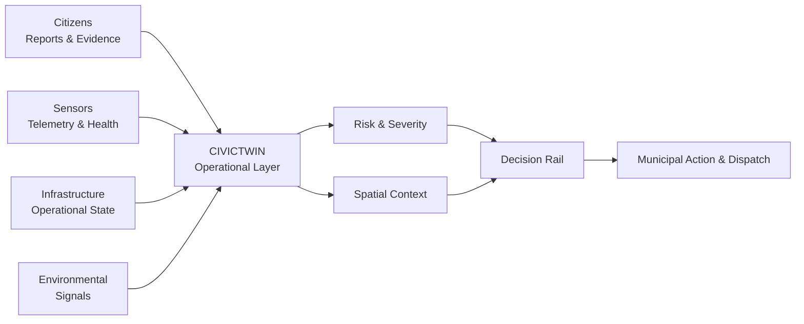
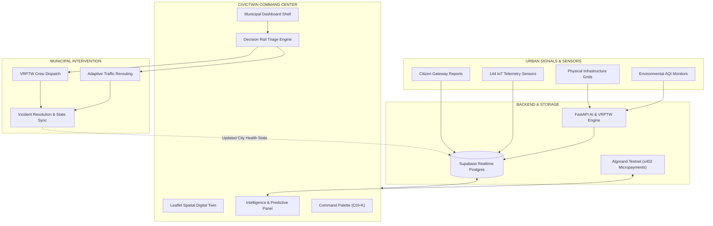
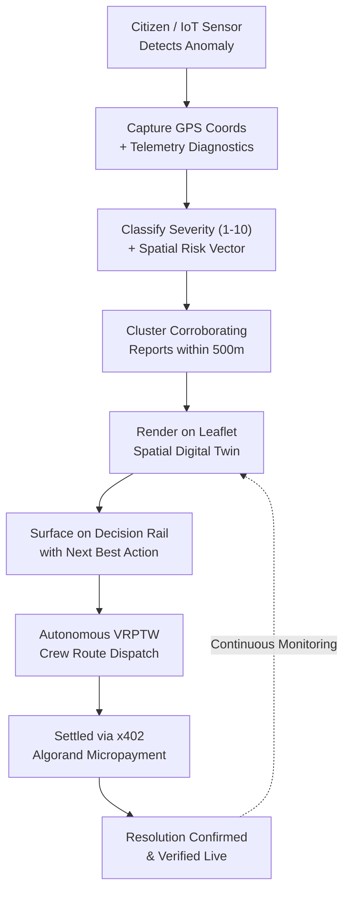
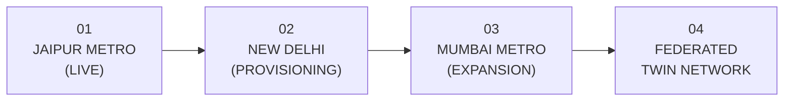

# CivicTwin
## Municipal Urban Operational Layer & Spatial Digital Twin

See the city. Predict the risk. Act before it escalates.

<p align="center"> <a href="https://civictwin.vercel.app/"><strong>Live Demo</strong></a> · <a href="https://github.com/SIDDHARTHXMEUR/CIVICTWIN"><strong>GitHub Repository</strong></a> </p>

### Overview
CivicTwin is a real-time municipal operations and spatial intelligence platform that turns fragmented urban signals into a single operational picture.
It brings together citizen reports, geographic GIS context, infrastructure status, sensor telemetry, predictive anomaly intelligence, severity prioritization, autonomous VRPTW crew dispatch, and x402 micropayment resolution workflows.

CivicTwin is the operational layer between what a city observes and what a city does.

> *Urban data is only valuable when it helps someone make a faster, better decision.*

---

### The Problem
A city can have the right data and still respond slowly.
A water leak begins as a citizen grievance. A pressure sensor detects an underground hydraulic drop. A traffic corridor experiences cascading gridlock. An environmental sensor reports an AQI surge.

When these signals live in separate silos, operators must manually connect the dots.

The operational chain becomes:
```
Report → Corroborate → Locate → Prioritize → Dispatch → Resolve → Verify
```
CivicTwin unites that entire lifecycle into a unified, high-density spatial workspace.

**From fragmented signals to one operational picture**

*What is happening? Where is it happening? How serious is it? What should happen next?*

---

## 📂 Repository Structure

The project uses a clean monorepo architecture separating frontend, backend services, and database schemas:

```
CIVICTWIN/
├── apps/
│   └── web/                 # Frontend: React 19, Vite, Zustand, Tailwind, Leaflet GIS
│       ├── src/
│       │   ├── components/  # All UI Modules (GIS Map, Decision Rail, Payments, etc.)
│       │   ├── store/       # Zustand persistent store & telemetry simulation engine
│       │   ├── config/      # Jaipur GIS center coordinates & map layer configs
│       │   └── lib/         # Web3 Algorand Testnet, audio SFX, and API clients
├── services/
│   └── api/                 # Backend: FastAPI, Python (AI prediction & VRPTW engines)
│       ├── routers/         # Simulation & optimal route optimization routers
│       └── main.py          # FastAPI application server entrypoint
├── supabase/
│   └── migrations/          # Declarative Postgres schema & Supabase Realtime policies
├── infra/                   # Docker orchestration and deployment assets
├── DESIGN_SYSTEM.md         # Comprehensive UI/UX & Tactical Neo-Brutalist Guidelines
├── README.md                # Project documentation (this file)
└── docker-compose.yml       # Local development orchestration
```

---

## 🚀 Quick Start (Local Development)

Run the full CivicTwin stack locally:

1. **Install dependencies:**
   Ensure you have `uv` (or `pip`) installed for Python, and `npm` for Node.js.
   ```bash
   cd apps/web && npm install
   cd ../../services/api && pip install -r requirements.txt
   ```
2. **Run the FastAPI Backend:**
   ```bash
   # From services/api/
   uvicorn main:app --reload --port 8000
   ```
   *FastAPI server runs on `localhost:8000` (Swagger UI at `http://localhost:8000/docs`).*
3. **Run the React Frontend:**
   ```bash
   # From apps/web/
   npm run dev
   ```
   *Vite development server runs on `http://localhost:5173`.*

---

## 01 — Comprehensive Feature Breakdown

### 🗺️ 1. Leaflet Spatial Digital Twin (GIS Centerpiece)
The Spatial Digital Twin is the geographic operating surface of CivicTwin:
- **High-Precision City Topology**: Centered on the Jaipur Metro Grid (`26.9124° N, 75.7873° E`) with 144 connected IoT sensor nodes.
- **Dynamic Severity Pin Encoding**:
  - *Normal* (`#64748b` / `#10b981`): 8px static calm baseline marker.
  - *Warning* (`#f59e0b`): 12px amber marker for elevated risk.
  - *Critical Anomaly* (`#ea3b1b`): 18px red-orange marker with animated radar pulsing rings.
- **Interactive Multi-Basemap Switching**: Toggle instantaneously between **Vector GIS**, **Satellite World Imagery** (ArcGIS), and **Topographic** elevation layers.
- **Edge-to-Edge Fullscreen GIS Mode**: Dynamic resizing engine invoking `map.invalidateSize()` across animation intervals to guarantee 100% viewport coverage.
- **Spatial Anomaly Propagation Vectors**: Visual dashed vector lines illustrating cascading failure drift (e.g. MI Road pressure surge → Ajmeri Gate traffic gridlock → Hawa Mahal corridor).
- **Interactive Asset Inspection Popups**: Click any map marker to view live frequency, latency, packet loss, and trigger simulated diagnostic tests.

---

### 🚨 2. Decision Rail & Contextual Triage Engine
The Decision Rail transforms incoming intelligence into instant operational action:
- **Severity Meter Strips**: Visual 10-segment color-coded severity bars (1–10 scale) on every incident card.
- **Root Cause & Telemetry Inspection Drawer**: Expandable analysis displaying underground hydraulic differentials, pressure spikes, and exact GPS coordinates.
- **Tactical Action Buttons**: Single-click actions such as `DISPATCH CREW`, `REROUTE TRAFFIC`, `ISOLATE GRID`, and `NOTIFY TRANSIT`.
- **Primary vs. Secondary Action Hierarchy**: Clear visual distinction between primary resolution triggers (vibrant fill) and secondary triage options (ghost outline).
- **Card Hover Elevation**: Tactical micro-interaction providing 1px cyan highlight and elevation shift on hover.
- **Resolved Today Log**: Keeps cleared incidents visible with relative timestamps (`Just now`, `5 min ago`) for complete auditability.

---

### 🚚 3. Autonomous VRPTW AI Crew Dispatch Routing
CivicTwin incorporates an automated Vehicle Routing Problem with Time Windows (VRPTW) engine:
- **FastAPI Routing Backend**: Algorithmic optimization endpoint (`/api/simulation/optimal-route`) calculating shortest emergency response paths.
- **Live Polyline Navigation Path**: Renders the multi-stop dispatch route on the Leaflet GIS map with glowing neon drop shadows (`#10b981`).
- **Turn-by-Turn Waypoints**: Generates precise GPS coordinate waypoints from municipal depots to incident hotspots.

---

### 💳 4. x402 Micropayment Protocol on Algorand Testnet
CivicTwin pioneers machine-to-machine micropayments for decentralized urban data access:
- **Payment-Gated AI Diagnostics**: 0.05 ALGO micropayment unlocks deep predictive infrastructure failure analysis.
- **Algorand Testnet Transaction Signing**: Direct integration with Algorand indexers and testnet node gateways.
- **Cryptographic Audit Ledger (`PaymentsPanel.tsx`)**: Transaction ledger tracking Tx Hashes, amounts, resource paths, and settled statuses.
- **Operational Resolution Action Report**: Native tactical report generated post-settlement detailing crew assignments and estimated resolution timeframes.

---

### 📱 5. Citizen Incident Gateway (`CitizenApp.tsx`)
A public-facing portal empowering citizens to submit infrastructure issues seamlessly:
- **4-Step Submission Stepper**:
  1. *Location*: Automatic GPS device geolocation tagging.
  2. *Category*: Selection across Water, Mobility, Environment, Electrical, and Structural.
  3. *Severity & Details*: User-reported severity slider and descriptive grievance input.
  4. *Evidence*: Image upload and immediate municipal command handoff.
- **Intelligent 500m Spatial Clustering**: Duplicate reports within 500 meters are automatically merged into parent incidents, updating `REPORTED BY: X` counters without cluttering the map.
- **Public Status Tracker**: Citizens receive unique tracking IDs (`JP-W01-XXXX`) to monitor real-time municipal resolution progress.

---

### 📊 6. Live KPI Strip & Telemetry Sparklines
Real-time urban health monitoring at the top of the command center:
- **Core City Metrics**:
  - *City Health Score* (0–100 scale) with alert thresholds.
  - *Mobility Flow* (%) tracking corridor transit efficiency.
  - *Air Quality Index* (AQI) monitoring particulate pollution.
- **SVG Area Gradient Sparklines**: Gradient fill under trend lines with pulsing live endpoint indicators.
- **Tabular Numerals (`font-variant-numeric: tabular-nums`)**: Eliminates horizontal jitter during live telemetry updates.
- **Continuous 3-Second Simulation Loop**: Simulates sensor jitter, packet loss fluctuations, and diagnostic pings.

---

### 🌐 7. Federated Multi-City Twin Registry
A scalable architecture designed for state-wide and national municipal cohorts:
- **Active Jaipur Metro Node**: Full operational telemetry (`26.9124° N, 75.7873° E`).
- **Upcoming City Provisioning Queue**: Interactive dropdown selector supporting **New Delhi** (28.84°N), **Mumbai Metro** (19.07°N), and **Bengaluru Tech** (12.97°N).
- **Federated Node Extensibility**: Pre-configured schema to support cross-city mutual aid dispatch.

---

### ⌨️ 8. Global Tactical Command Palette (`Ctrl+K`)
Keyboard-driven mission control navigation:
- **Fuzzy Search**: Search across all 144 sensor assets, active critical incidents, and domain views.
- **Emergency Shortcut Commands**: Trigger simulated grid anomalies, clear filters, and navigate to public or officer portals instantly.
- **Top Bar Integration**: Quick `[COMMANDS Ctrl K]` button in the top bar for easy discoverability.

---

### 📄 9. Municipal Operational Briefing PDF Export
Generate formal municipal reports with one click:
- **Executive Summary**: City health score, unresolved incident count, and settled micropayments.
- **Incident Matrix**: Tabular breakdown of incident IDs, severity scores, descriptions, and current lifecycle states.
- **x402 Audit Log**: Full cryptographic transaction hash ledger for administrative accountability.

---

## 02 — Product Architecture & Data Flow



---

## 03 — End-to-End Operational Lifecycle


`Detect → Locate → Prioritize → Dispatch → Settle → Verify`

---

## 04 — Application Modules Reference

| Module | File Path | Core Responsibilities |
| :--- | :--- | :--- |
| `Gateway.tsx` | `apps/web/src/components/` | Municipal landing, citizen vs. officer authentication, GIS map preview, system search |
| `CitizenApp.tsx` | `apps/web/src/components/` | Citizen reporting stepper, automatic GPS tagging, severity selection, photo upload |
| `App.tsx` | `apps/web/src/` | Main application shell, route views, realtime toast alerts, scrolling operational ticker |
| `GridTopologyPanel.tsx` | `apps/web/src/components/` | Leaflet GIS digital twin, vector/satellite/topo layers, fullscreen mode, crew polylines |
| `IntelligencePanel.tsx` | `apps/web/src/components/` | AI predictive failure reports, x402 payment gate, post-payment resolution action card |
| `DecisionRail.tsx` | `apps/web/src/components/` | Critical & warning alerts, severity meter bars, root-cause drawer, rapid action buttons |
| `KpiStrip.tsx` | `apps/web/src/components/` | High-impact telemetry metrics with SVG area gradient sparklines and delta percentages |
| `PaymentsPanel.tsx` | `apps/web/src/components/` | Algorand transaction ledger, x402 status verification, explorer tx hash links |
| `CommandPalette.tsx` | `apps/web/src/components/` | `Ctrl+K` modal for fuzzy searching nodes, incidents, and triggering municipal actions |
| `Sidebar.tsx` | `apps/web/src/components/` | Domain navigation (Infrastructure, Mobility, Environment, Payments) with active count badges |
| `TopBar.tsx` | `apps/web/src/components/` | Federated city switcher, briefing PDF export, dark/light theme toggle, user profile |

---

## 05 — Design System & Mission Control Typography

CivicTwin follows a **Tactical Mission Control / Functionalist** design system built for high-stress municipal operations.

### Typography Triad
- **Display & Headers**: **`Space Grotesk`** (Weights: 600, 700, 800 | Tracking: `-0.02em`) — Geometric, authoritative architectural character for panel titles and brand identity.
- **Body & Cards**: **`Plus Jakarta Sans`** (Weights: 400, 500, 600) — Humanist, ultra-crisp legibility across high-density incident cards.
- **Telemetry & Numbers**: **`JetBrains Mono`** (Weights: 500, 700, 800 | Tabular Figures: `tnum 1`) — Monospace alignment for GPS coordinates, sparkline values, and Algorand transaction hashes.

### Color Tokens
| Token | Hex Value | Operational Meaning |
| :--- | :--- | :--- |
| **Civic Cyan** | `#4FC9DC` | Active selection, route polylines, and primary operational accents |
| **Critical Red** | `#EA3B1B` | Anomaly nodes, critical severity (7–10), and emergency dispatch |
| **Warning Amber** | `#F59E0B` | Elevated risk, warning telemetry (4–6), and cascade notices |
| **Resolved Emerald** | `#10B981` | Settled micropayments, normal status (1–3), and verified nodes |
| **Obsidian Slate** | `#0B0C0E` / `#161922` | Dark mode tactical background and card frames |
| **Warm Sand** | `#F0EDE4` / `#F5F2E8` | Light mode canvas and component surfaces |

---

## 06 — Technology Stack

| Layer | Technologies |
| :--- | :--- |
| **Frontend Framework** | React 19, TypeScript |
| **Build & Dev Tools** | Vite v8, Tailwind CSS, PostCSS |
| **State & Store** | Zustand (Persistent store & active telemetry simulation loops) |
| **GIS Mapping** | Leaflet, React-Leaflet, CartoDB & ArcGIS Tile Layers |
| **Backend API** | FastAPI (Python 3.12, Uvicorn, Pydantic) |
| **Database & Realtime** | Supabase Postgres (Realtime broadcast channels & RLS) |
| **Blockchain / Web3** | Algorand Testnet (x402 Micropayments & TX Hash verification) |
| **Icons & Typography** | Lucide React, Space Grotesk, Plus Jakarta Sans, JetBrains Mono |

---

## 07 — Roadmap & Multi-City Expansion



- **Phase 01 — Jaipur Operational Twin (Active)**: Full GIS digital twin, decision rail, autonomous VRPTW dispatch, and x402 payment gate.
- **Phase 02 — Multi-City Federated Registry**: Cross-city node telemetry sync and automated regional emergency escalation.
- **Phase 03 — Predictive Computer Vision**: Live CCTV traffic-flow computer vision integration and automated road fracture detection.
- **Phase 04 — Autonomous Municipal Swarms**: Direct integration with municipal UAVs, smart water pumps, and SCADA traffic light grids.

---

## 08 — Vision

Cities already generate enormous volumes of data. The missing layer is not another dashboard — it is the **operational workspace** connecting those signals directly to decisions and immediate actions.

**CivicTwin**  
**Municipal Urban Operational Layer & Spatial Digital Twin**  
*Observe → Predict → Act*

<p align="center"> <a href="https://civictwin.vercel.app/"><strong>Live Demo</strong></a> · <a href="https://github.com/SIDDHARTHXMEUR/CIVICTWIN"><strong>Repository</strong></a> </p>

**Built for Urban Intelligence**
